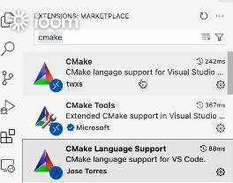
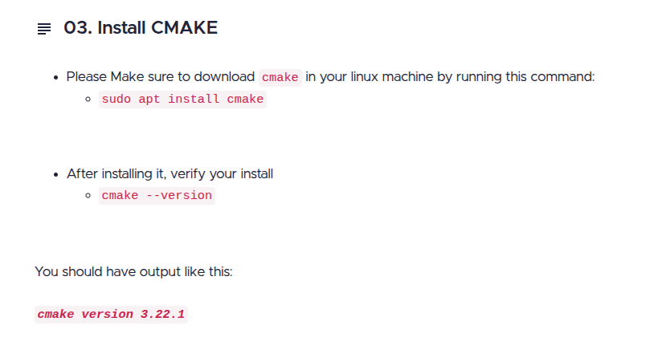
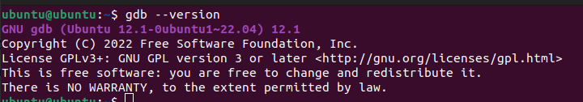

# prerequisits
 1- using ubuntu 22.04
 2- download vs code 
 3- compile, run,debug -->using cmake tools
   - install cmake ,cmake tool ,cmake language support extensions from vs code

 4- install GDB
  - check that gdb debugger is installed ,if not -->sudo apt update --> sudo apt install gdb

 5- folder structure
  - build
  - includes
  - src -->contains all cpp files
  - utils
  - CMakeLists.txt ->as we depend on cmake as a build system to build our environment
   
- after creating cpp file inside src folder add the file's path in  CMakeLists.txt inside set(source ... 

- when the application runs we are now sure that cmake connected with g++ compiler

# purpose of the course 
understand the meaning of the template used in buiding the standard templae libraries
 

